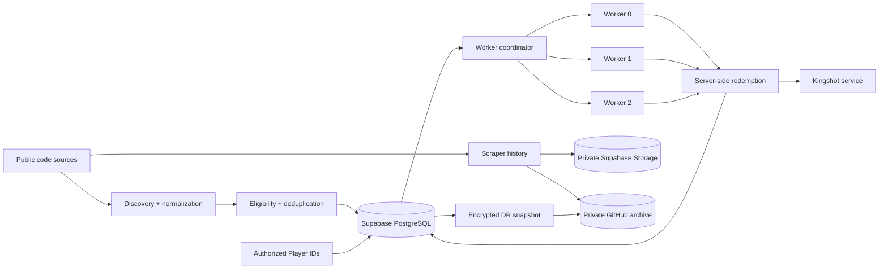
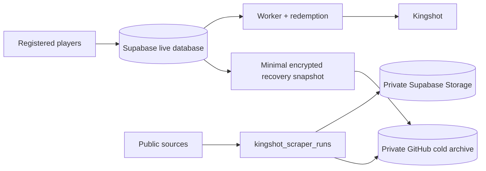

<div align="center">


# Kingshot Auto Redeemer

**A production-grade community service for discovering, tracking, and redeeming eligible Kingshot gift codes.**

[](https://kingshot-autoredeemer.vercel.app/)
[](https://nodejs.org/)
[](https://react.dev/)
[](https://vite.dev/)
[](https://supabase.com/)
[](https://vercel.com/)
[](./LICENSE)
[](https://github.com/Judson-web/kingshot-auto-redeemer/actions/workflows/guardrails.yml)

[**Website →**](https://kingshot-autoredeemer.vercel.app/) · [**How it works →**](https://kingshot-autoredeemer.vercel.app/info) · [**Issues →**](https://github.com/Judson-web/kingshot-auto-redeemer/issues)

</div>

> **Independent community service:** This project is not affiliated with, endorsed by, or operated by Century Games.

## What this project does

Kingshot Auto Redeemer automates the boring parts of gift-code redemption without turning the worker into a fragile one-off script.

It can:

- discover eligible public gift codes from configured sources
- normalize and deduplicate codes before processing
- track code history and redemption outcomes
- automatically redeem codes for authorized Player IDs
- backfill eligible codes that were missed
- provide manual redemption through the website
- revalidate player/kingdom information when required
- coordinate concurrent workers with durable database state
- retain a separate, privacy-conscious scraper archive
- maintain an isolated disaster-recovery path for registered players

The application is designed around one principle: **the live database remains the source of truth for the worker.**

## Architecture



The production service runs on Vercel with Supabase/PostgreSQL providing durable application state. Domain logic is progressively isolated in TypeScript modules under `internal/kingshot/`, while the API files remain thin HTTP adapters.

The worker uses three deterministic shards with six concurrent player operations per worker. Gift-code discovery, redemption, player lookup, and registration now have typed domain boundaries that can be validated independently. Database-backed leases and atomic claims prevent multiple workers from intentionally processing the same player/code combination at the same time.

The GitHub archive and scraper archive are **downstream systems**. The normal redemption worker does not depend on GitHub, the cold archive, or the disaster-recovery snapshot.

## Core design

### 1. Discovery without duplicate chaos

Public sources are normalized into a common representation before codes are considered for redemption. Duplicate observations do not become duplicate redemption work.

The system also keeps persistent history so a previously handled code can be recognized without repeatedly hammering the upstream redemption service.

### 2. Durable worker coordination

The worker is intentionally stateless between invocations. Coordination state lives in Supabase.

The production worker uses:

- deterministic worker sharding
- durable leases
- heartbeats
- atomic player/code claims
- persistent redemption history
- retry handling for transient upstream failures
- explicit stale-player handling
- rate-aware upstream validation

A temporary worker restart should not turn into a duplicate-redemption storm.

### 3. Kingdom and player validation

Player validation is handled server-side through the configured player-data provider.

Normal scheduled validation respects the reset/cooldown logic. A protected manual kingdom-check mode can force validation when an operator needs an immediate consistency check, without starting the redemption worker or discovering codes.

Rate-limited upstream responses are treated as upstream conditions rather than reasons to rotate IPs or bypass limits.

### 4. Backfill

Backfill exists for a practical reason: a player can miss a code while offline, before registration, or during an interruption.

Only codes that remain eligible are considered. Persistent history and atomic claims keep backfill from becoming uncontrolled duplicate work.

## Data and privacy boundary

Live operational data and scraper history are intentionally separated.



### Live database

The live Supabase database contains the operational state required by the service, including registered Player IDs, player/kingdom information, registration state, and redemption history.

### Scraper archive

The scraper archive records code-discovery telemetry such as:

```text
id
source
checked_at
http_status
code_count
codes
parse_ok
error_category
error_message
```

The scraper archive contains **no Player IDs, Discord IDs, account IDs, or registration IDs**.

It is not used by the worker to select players, claim redemptions, or execute redemption requests.

### Disaster recovery

A separate private GitHub recovery area stores minimal registered-player snapshots for disaster recovery.

Recovery snapshots contain only the minimum state needed to restore missing registrations:

- `player_id`
- `enabled`
- `stale`
- snapshot metadata
- SHA-256 integrity data

They do not contain Discord IDs, authentication credentials, passkeys, session tokens, or redemption history.

Recovery is deliberately fail-closed. The normal worker never reads GitHub as a registration source. A recovery workflow validates the snapshot, compares it with Supabase, and inserts only missing records. Existing live records are not overwritten.

Recovery snapshots are encrypted off-site using AES-256-GCM, with the encryption key stored outside the repository.

## Reliability and recovery

The project treats backups as an operational system, not as a folder full of JSON files.

The infrastructure includes:

- verified scraper archives
- encrypted registered-player recovery snapshots
- checksum validation
- DR vault health checks
- off-site backup verification
- disaster-recovery rehearsal
- ephemeral restore testing
- RTO/RPO validation
- GitHub Actions automation

The recovery rehearsal restores into an **ephemeral SQLite database** for validation. It does not modify production.

The production database remains the authoritative source of truth.

## Security model

Secrets are never committed to the repository.

Production credentials and sensitive configuration are kept in deployment/repository secret stores, including items such as:

- Supabase service-role credentials
- MightPulse/Kingshot API credentials
- Discord webhook credentials
- cron/authentication secrets
- DR encryption keys

The repository also includes security regression checks and database privilege checks.

Protected operational endpoints require server-side authentication. The public website does not expose privileged credentials or signing material.

## Redemption outcomes

The redemption layer maps common upstream results into stable internal outcomes:

| Status | Meaning |
|---|---|
| `SUCCESS` | Redemption completed. |
| `RECEIVED` | Code was already redeemed/received. |
| `SAME TYPE EXCHANGE` | The relevant reward type was already handled. |
| `TIME_ERROR` | Code is expired. |
| `CDK_NOT_FOUND` | Code is invalid or unavailable. |
| `USAGE_LIMIT` | Code reached its usage limit. |

Transient upstream errors, rate limits, authentication failures, and stale-player conditions are tracked separately.

## Observability and guardrails

The repository production checks cover more than just "does the build compile?"

The guardrail pipeline includes:

- security regression checks
- unit tests
- production build validation
- production smoke tests
- worker watchdog checks
- scheduled health verification

Operational workflows also cover manual kingdom validation and disaster-recovery verification.

## Website

| Route | Purpose |
|---|---|
| `/` | Main service |
| `/auto` | Automatic redemption |
| `/manual` | Manual redemption |
| `/info` | Service documentation |
| `/terms` | Terms of service |
| `/privacy` | Privacy information |

## Technology

| Layer | Technology |
|---|---|
| Frontend | React 19 + Vite 6 |
| Runtime | Node.js 24.x + TypeScript 5.9 |
| Deployment | Vercel |
| Database | Supabase PostgreSQL |
| Storage | Supabase Storage |
| Automation | GitHub Actions |
| Recovery | Private GitHub archive + encrypted DR vault |
| License | AGPL-3.0 |

## Local development

### Requirements

- Node.js 24.x
- npm

Install dependencies:

```bash
npm install
```

Start the development server:

```bash
npm run dev
```

Create a production build:

```bash
npm run build
```

Preview the production build:

```bash
npm run preview
```

Run the test suite:

```bash
npm test
```

## Environment

Production secrets are configured through the deployment environment and repository secrets. They must never be committed.

Do not commit:

- Supabase service-role or secret keys
- Kingshot/MightPulse credentials
- Discord credentials or webhook secrets
- cron/authentication secrets
- admin credentials
- session tokens
- DR encryption keys

Use local environment files only for development, and keep them outside version control.

## Acceptable use

Automation is permitted. Abuse is not.

Use only authorized Player IDs and legitimate public gift codes.

Do not use this project to:

- bypass quotas or authentication
- evade upstream rate limits
- rotate IPs to circumvent restrictions
- flood upstream endpoints
- intentionally create duplicate redemption work
- probe protected endpoints
- harvest private data
- manipulate redemption requests or results
- automate accounts or services without authorization

The service may throttle, suspend, revoke, or block access when necessary to protect users, the service, or upstream systems.

## Contributing

Production-sensitive areas include redemption behavior, worker coordination, database functions, authentication, API security, and recovery workflows.

Before submitting changes:

1. Keep changes focused.
2. Run `npm test`.
3. Run `npm run build`.
4. Review security-sensitive changes carefully.
5. Never commit credentials or private user data.

For larger architectural changes, open an issue first so the operational and recovery implications can be reviewed.

## Project status

This is an actively maintained production service rather than a demo implementation.

The architecture deliberately favors boring, durable components over unnecessary infrastructure:

- one production database
- one queryable scraper archive
- one private cold-backup repository
- encrypted disaster-recovery snapshots
- deterministic workers
- database-backed coordination
- automated validation and recovery checks

There is intentionally no second production database, no IP-rotation layer, and no dependency on the cold archive during normal redemption.

## License

This project is licensed under the **GNU Affero General Public License v3.0 (AGPL-3.0)**. See [LICENSE](./LICENSE).

AGPL-3.0 keeps the project open source while requiring modified versions offered as a network service to make their corresponding source available under the same license.