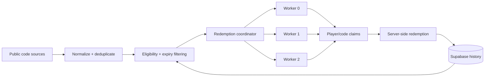
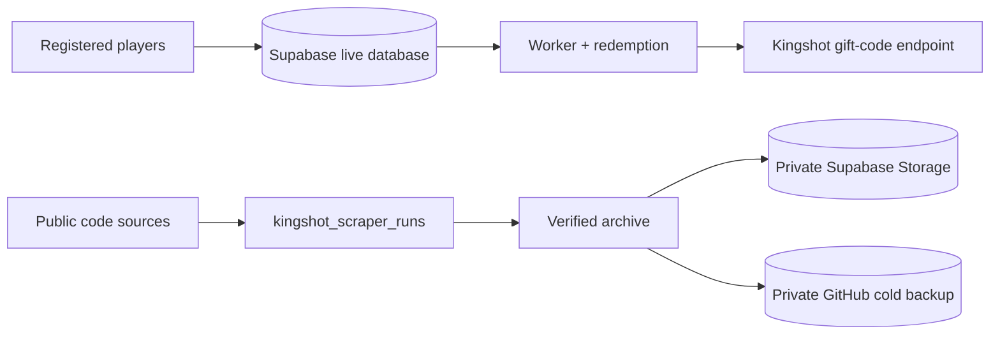

<div align="center">


# Kingshot Auto Redeemer

**Automated Kingshot gift-code discovery, redemption, and backfill.**

[](https://kingshot-autoredeemer.vercel.app/)
[](https://nodejs.org/)
[](https://react.dev/)
[](https://vite.dev/)
[](https://supabase.com/)
[](https://vercel.com/)
[](https://github.com/Judson-web/kingshot-auto-redeemer/actions/workflows/guardrails.yml)

[**Website →**](https://kingshot-autoredeemer.vercel.app/) · [**How it works →**](https://kingshot-autoredeemer.vercel.app/info) · [**Issues →**](https://github.com/Judson-web/kingshot-auto-redeemer/issues)

</div>

> **Independent community service:** This project is not affiliated with, endorsed by, or operated by Century Games.

## Overview

Kingshot Auto Redeemer is a server-side automation service for eligible Kingshot gift codes. It supports continuous discovery, automatic redemption, manual redemption, and backfill for codes that were legitimately missed.

The same redemption core powers the public website and the auto-redeem worker system, while privileged signing material remains server-side.

## What you can build

| Capability | Intended use |
|---|---|
| **Auto-redeem** | Periodically redeem eligible public gift codes for an authorized Player ID. |
| **Backfill** | Catch up on still-eligible codes missed while offline, before registration, or during an interruption. |
| **Bots & workers** | Run scheduled Discord bots, backend jobs, or community services. |
| **Manual redemption** | Submit a specific code directly from the website. |
| **Code discovery** | Normalize and deduplicate codes from configured public sources. |
| **Persistent history** | Prevent unnecessary duplicate processing and preserve redemption outcomes. |

## Automatic redemption architecture



Production coordination runs every minute. The current worker pool uses three durable shards, six concurrent player operations per worker, deterministic sharding, durable leases, atomic player/code claims, and persistent completion history.

## Data architecture and privacy boundary

The service deliberately separates live user/redemption data from scraper history.



The live Supabase database contains the operational data required to provide Auto Redeem, including registered Player IDs, kingdom information, player metadata, registration state, and redemption history. These records remain in the guarded live database and are not part of the scraper archive.

The archive tier is intentionally limited to the scraper history table, `kingshot_scraper_runs`. Its verified schema is:

```text
id
source
checked_at
http_status
code_count
codes
parse_ok
error_category
error_message
```

The scraper archive contains **no Player IDs, Discord IDs, account IDs, or registration IDs**. It is not used by the worker to select players, claim redemptions, or call the Kingshot redemption endpoint.

The archive does contain the gift codes discovered by the scraper and their detection history. This makes the archive operational intelligence: it preserves when codes were observed, by which source, and how the scraper processed them. The archive is therefore private by design, as a historical record and competitive asset, not as a user-identity store.

The data boundary is:

- **Live Supabase:** player registrations, player metadata, redemption state/history, and other operational records.
- **Scraper archive:** PII-free scraper telemetry and discovered-code history.
- **Private Supabase Storage:** queryable historical archive.
- **Private GitHub repository:** independent cold backup of the verified archive.
- **Kingshot:** receives only the server-side redemption request required for an actual redemption.

The GitHub archive is downstream of the live system. It is not a dependency of worker execution or redemption.

## Redemption statuses

The redemption layer maps common upstream results into stable internal outcomes, including:

- `SUCCESS` — redemption completed.
- `RECEIVED` — already redeemed/received.
- `SAME TYPE EXCHANGE` — already handled for the relevant reward type.
- `TIME_ERROR` — code expired.
- `CDK_NOT_FOUND` — code invalid or unavailable.
- `USAGE_LIMIT` — code reached its usage limit.

Upstream rate-limit, login, and player errors may also be recorded.

## Acceptable use

Automation is permitted. Abuse is not.

Use only authorized Player IDs and legitimate public gift codes. Do not use the service to bypass quotas, evade authentication, flood requests, generate duplicate work intentionally, probe protected endpoints, harvest private data, manipulate redemption requests or results, or automate accounts/services without authorization.

We may throttle, suspend, revoke, or block access when necessary to protect users, the service, or upstream systems.

## Architecture and infrastructure

The application uses Vercel for deployment and Supabase/PostgreSQL for persistent state. Privileged operations, worker coordination, authentication, and redemption signing remain server-side.

The repository contains security regression checks, production smoke tests, worker health checks, API guardrails, and database privilege checks.

## Website

| Route | Purpose |
|---|---|
| `/` | Main service |
| `/auto` | Automatic redemption |
| `/manual` | Manual redemption |
| `/info` | Service documentation |
| `/terms` | Terms |
| `/privacy` | Privacy |

## Local development

**Requirements:** Node.js 22.x and npm.

```bash
npm install
npm run dev
```

Production build:

```bash
npm run build
```

Preview:

```bash
npm run preview
```

## Environment

Production secrets are configured through the deployment environment and are never committed to the repository.

Do not commit:

- Supabase service-role or secret keys
- Kingshot API/signing secrets
- Discord credentials
- admin passwords
- session tokens

## Contributing

Changes involving redemption behavior, workers, database functions, authentication, API security, or public contracts are production-sensitive. Keep focused changes isolated, run the relevant regression checks, and never include credentials in commits.

## License

MIT — see [LICENSE](./LICENSE).
