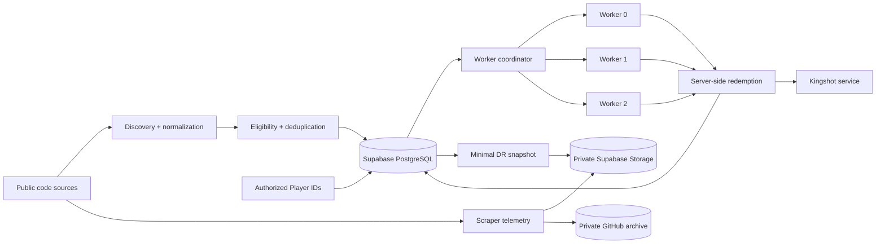
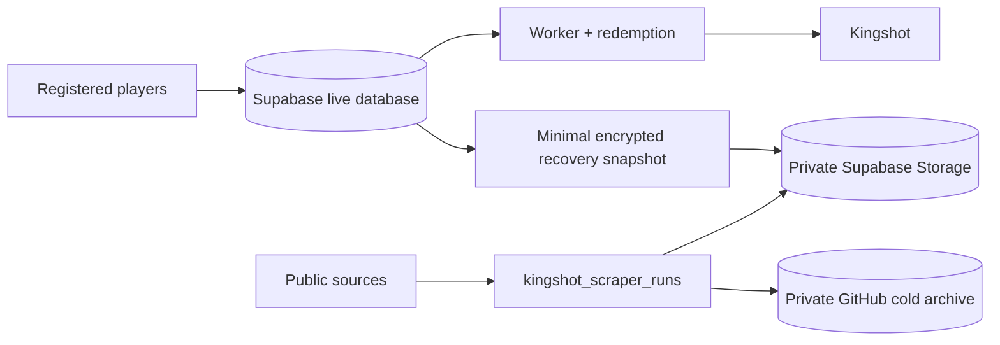

<div align="center">


# Kingshot Auto Redeemer

**A production-grade community service for discovering, tracking, and redeeming eligible Kingshot gift codes.**

[](https://kingshot-autoredeemer.vercel.app/)
[](https://kingshot-autoredeemer.vercel.app/)
[](https://github.com/Judson-web/kingshot-auto-redeemer/actions/workflows/guardrails.yml)
[](https://nodejs.org/)
[](https://react.dev/)
[](https://vite.dev/)
[](https://supabase.com/)
[](https://vercel.com/)
[](./LICENSE)

[**Open the service →**](https://kingshot-autoredeemer.vercel.app/) · [**How it works →**](https://kingshot-autoredeemer.vercel.app/info) · [**Report an issue →**](https://github.com/Judson-web/kingshot-auto-redeemer/issues)

</div>

> **Independent community service:** This project is not affiliated with, endorsed by, or operated by Century Games.

---

## ✦ At a glance

| Area | What it does |
|---|---|
| 🎁 **Code discovery** | Collects eligible public gift codes from configured sources |
| ⚙️ **Automatic redemption** | Processes registered Player IDs through coordinated workers |
| 🔁 **Backfill** | Catches eligible codes missed while a player was offline or unavailable |
| 👤 **Player validation** | Revalidates player and kingdom data when required |
| 📊 **Telemetry** | Tracks discovery, parsing, redemption, and operational outcomes |
| 🗄️ **Archive** | Keeps scraper history in a separate private archive |
| 🛡️ **Disaster recovery** | Maintains verified, encrypted recovery material |
| 🔐 **Security** | Uses server-side credentials, rate-aware behavior, and regression checks |

## ✦ What it does

Kingshot Auto Redeemer automates the repetitive parts of gift-code redemption without turning the worker into a fragile one-off script.

The service can:

- discover eligible public gift codes from configured sources
- normalize and deduplicate codes before processing
- track code history and redemption outcomes
- automatically redeem codes for authorized Player IDs
- backfill eligible codes that were missed
- provide manual redemption through the website
- revalidate player and kingdom information when required
- coordinate concurrent workers using durable database state
- retain a privacy-conscious scraper archive
- maintain an isolated disaster-recovery path for registered players

**Core rule:** the live Supabase database remains the operational source of truth for the production worker.

## ✦ Architecture



The production service runs on Vercel, with Supabase/PostgreSQL providing durable application state. The TypeScript migration is in progress: TypeScript 5.9 type-checking is part of CI, but the repository still contains JavaScript/JSX modules. Do not treat the migration as complete until the remaining modules are converted and the full regression suite passes.

The worker is coordinated through database-backed state rather than process-local memory. Worker sharding, leases, heartbeats, atomic claims, retry handling, and persistent redemption history are designed to prevent duplicate work across concurrent invocations.

Player lookups can refresh the stored profile of an already-registered Player ID when fresh provider data is available. This does not reset the scheduler's kingdom-validation cooldown.

The archive and DR systems are downstream of production. **Normal redemption does not depend on GitHub, the cold archive, or the DR vault.** The private archive repository's README publishes its generated checkpoint and recovery status; consult it before treating a backup as current. At the latest checked archive state (9 October 2026), the encrypted offsite copy was **not yet matched to the latest recovery point**, so offsite freshness still required verification.

## ✦ Data & privacy boundary

Operational data and scraper history are intentionally separated.



### Live database

The live database contains the operational state required by the service, including registered Player IDs, player and kingdom information, registration state, and redemption history.

### Scraper archive

The scraper archive records discovery telemetry such as:

```text
id
source
checked_at
http_status
code_count
codes
parse_ok
error_category
error_message
```

It contains **no Player IDs, Discord IDs, account IDs, or registration IDs**.

The archive is not used by the worker to select players, claim redemptions, or execute redemption requests.

### Disaster recovery

The DR control plane maintains minimal registered-player recovery material separately from the production worker.

Recovery material is designed around the minimum state needed to restore missing registrations, including:

- `player_id`
- `enabled`
- `stale`
- snapshot metadata
- SHA-256 integrity data

It does not contain Discord IDs, authentication credentials, passkeys, session tokens, or redemption history.

Recovery is fail-closed. A recovery workflow validates the snapshot, compares it with Supabase, and inserts only missing records. Existing live records are not overwritten.

Registered-player snapshots are encrypted off-site with **AES-256-GCM**. The encryption key is stored outside the repository.

## ✦ Reliability & recovery

Backups are treated as an operational system, not as a folder full of JSON files.

The infrastructure includes:

- immutable, checksum-verified scraper archives
- encrypted registered-player recovery snapshots
- recovery-point chain validation
- off-site backup verification
- DR vault health checks
- restore rehearsals
- ephemeral restore testing
- RTO/RPO validation
- GitHub Actions automation

The recovery rehearsal restores into an **ephemeral SQLite database** and does not modify production.

The production database remains authoritative.

## ✦ Security model

Secrets are never committed to the repository.

Sensitive configuration is kept in deployment or repository secret stores, including:

- Supabase service-role credentials
- Kingshot/MightPulse API credentials
- Discord webhook credentials
- scheduler/authentication secrets
- DR encryption keys

The repository includes security regression checks and database privilege checks.

Privileged operational endpoints require server-side authentication. The public website does not expose privileged credentials or signing material.

### Rate limiting

Upstream rate limits are treated as upstream conditions. The service does **not** rotate IPs or attempt to bypass provider restrictions.

## ✦ Redemption outcomes

The redemption layer maps common upstream results into stable internal outcomes:

| Status | Meaning |
|---|---|
| `SUCCESS` | Redemption completed. |
| `RECEIVED` | Code was already redeemed/received. |
| `SAME TYPE EXCHANGE` | The relevant reward type was already handled. |
| `TIME_ERROR` | Code is expired. |
| `CDK_NOT_FOUND` | Code is invalid or unavailable. |
| `USAGE_LIMIT` | Code reached its usage limit. |

Transient upstream errors, rate limits, authentication failures, and stale-player conditions are tracked separately.

## ✦ Observability & guardrails

The CI/production checks cover more than whether the project compiles.

They include:

- security regression checks
- unit tests
- TypeScript type checking
- production build validation
- production smoke tests
- worker watchdog checks
- scheduled health verification
- disaster-recovery verification

The goal is simple: **a green build should mean more than “the frontend compiled.”**

## ✦ Website

| Route | Purpose |
|---|---|
| `/` | Main service |
| `/auto` | Automatic redemption |
| `/manual` | Manual redemption |
| `/info` | Service documentation |
| `/terms` | Terms of service |
| `/privacy` | Privacy information |

## ✦ Technology

| Layer | Technology |
|---|---|
| Frontend | React 19 + Vite 6 |
| Runtime | Node.js 24.x + TypeScript 5.9 |
| Deployment | Vercel |
| Database | Supabase PostgreSQL |
| Storage | Supabase Storage |
| Automation | GitHub Actions |
| Recovery | Private GitHub archive + encrypted DR vault; check archive README for live checkpoint/backup status |
| License | AGPL-3.0 |

## ✦ Local development

### Requirements

- Node.js **24.x**
- npm

### Install

```bash
npm install
```

### Development server

```bash
npm run dev
```

### Production build

```bash
npm run build
```

### Production preview

```bash
npm run preview
```

### Tests

```bash
npm test
```

### Type checking

```bash
npm run typecheck
```

## ✦ Environment & secrets

Production secrets are configured through the deployment environment and repository secret stores.

**Never commit:**

- Supabase service-role or secret keys
- Kingshot/MightPulse credentials
- Discord credentials or webhook secrets
- scheduler/authentication secrets
- admin credentials
- session tokens
- DR encryption keys

Use local environment files only for development, and keep them outside version control.

## ✦ Acceptable use

Automation is permitted. Abuse is not.

Use only authorized Player IDs and legitimate public gift codes.

Do not use this project to:

- bypass quotas or authentication
- evade upstream rate limits
- rotate IPs to circumvent restrictions
- flood upstream endpoints
- intentionally create duplicate redemption work
- probe protected endpoints
- harvest private data
- manipulate redemption requests or results
- automate accounts or services without authorization

The service may throttle, suspend, revoke, or block access when necessary to protect users, the service, or upstream systems.

## ✦ Contributing

Production-sensitive areas include redemption behavior, worker coordination, database functions, authentication, API security, and recovery workflows.

Before submitting changes:

1. Keep changes focused.
2. Run `npm test`.
3. Run `npm run typecheck`.
4. Run `npm run build`.
5. Review security-sensitive changes carefully.
6. Never commit credentials or private user data.

For larger architectural changes, open an issue first so operational and recovery implications can be reviewed.

## ✦ Project status

This is an actively maintained production service, not a demo implementation.

The architecture deliberately favors boring, durable components over unnecessary infrastructure:

- one production database
- one queryable scraper archive
- one private cold-backup repository
- encrypted disaster-recovery snapshots
- deterministic worker coordination
- database-backed claims and leases
- automated validation and recovery checks

There is intentionally **no second production database, no IP-rotation layer, and no dependency on the cold archive during normal redemption.**

## ✦ License

This project is licensed under the **GNU Affero General Public License v3.0 (AGPL-3.0)**. See [LICENSE](./LICENSE).

AGPL-3.0 keeps the project open source while requiring modified versions offered as a network service to make their corresponding source available under the same license.

---

<div align="center">

**Built for reliable, boring redemption.**

<sub>Independent community software · No Century Games affiliation</sub>

</div>
